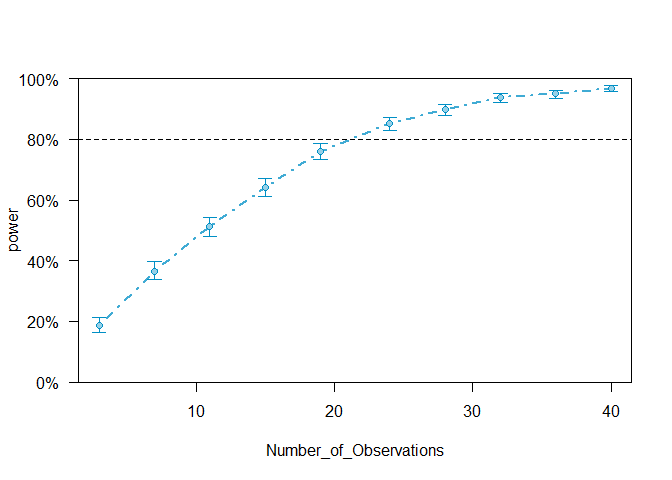

## Sources
1. Green & MacLeod's 2016 paper, titled, "SIMR: an R package for power analysis of generalized linear mixed models by simulation"
2. Dr. Humburg's post on conducing power analyses using "simr" (https://humburg.github.io/Power-Analysis/simr_power_analysis.html)

## Data Generation
### Create the Dataframe
#### In this section, we create the base dataframe with instruction methods and indexes of difficulty for our population.

```r
knitr::opts_chunk$set(message = FALSE)

# first, create our variables
instr <- c('accuracy', 'speed') # two instruction methods
index <- c(1.807, 1.17, 0.874) # three indexes of difficulty
ss <- 100002 # create a sample size for our population
instr2 <- rep(instr, each = ss/2) # repeat instruction methods 
index2 <- rep(index, each = ss/6) # repeat index of difficulty

# concatenate all of that into a dataframe
df_pop <- data.frame(instr_meth=factor(instr2), indx_dff=index2)
```

### Estimate Cornering Times
#### In this section, we create the estimated cornering times. We will do this using Pastel et al.'s (2007) fitted model. For the accuracy condition, we will create a sample of probable values for each of the three indexes of difficulty. This is done by using the fitted model (plus some variability). 
#### We will then do the same for the speed condition. Except here, we will reduce cornering times by 10% - as we expect cornering time to decrease when subjects are told to focus only on speed. 


```r
# define error term to induce some variability in our estimates 
error_term <- rnorm(ss/6, mean=0, sd = 0.7) 

# use Pastel et al.'s (2007) fitted model to get estimated cornering times for each index of difficulty
Y1 <- 0.975 + .787*1.807 + error_term
Y2 <- 0.975 + .787*1.17 + error_term
Y3 <- 0.975 + .787*0.874 + error_term

# Then do the same for the speed condition (but reduce estimated cornering time by 10%)
Y4 <- (0.975 + .787*1.807 + error_term)*.9
Y5 <- (0.975 + .787*1.17 + error_term)*.9
Y6 <- (0.975 + .787*0.874 + error_term)*.9

# finally, we append to our df
df_pop$ct <- c(Y1, Y2, Y3, Y4, Y5, Y6)

# then, we create a sample of this population so we can assess power
pid <- factor(1:10) # ten subjects
PID <- rep(pid, each = 3) # repeat participant ID 3 times each
IM <- rep(rep(instr, each = 3), 5) # repeat instruction method 3 times each and do that five times
ID <- rep(index, 10) # repeat index of difficulty values 10 times

# Now, we concatenate all of that into a dataframe
df_sample <- data.frame(PID=PID, IM=factor(IM), ID=ID)

# get cornering times from our population
df_sample$ct <- matrix(replicate(5, c(sample(Y1, 1, replace = T), sample(Y2, 1, replace = T), 
                                      sample(Y3, 1, replace = T), sample(Y4, 1, replace = T), 
                                      sample(Y5, 1, replace = T), sample(Y6, 1, replace = T))), ncol=1)
# view our sample data
head(df_sample, n=10)
```

```
##    PID       IM    ID        ct
## 1    1 accuracy 1.807 2.1063001
## 2    1 accuracy 1.170 3.1056480
## 3    1 accuracy 0.874 0.6703624
## 4    2    speed 1.807 1.8034647
## 5    2    speed 1.170 1.4225342
## 6    2    speed 0.874 0.7918512
## 7    3 accuracy 1.807 2.6299579
## 8    3 accuracy 1.170 1.3084242
## 9    3 accuracy 0.874 1.4353332
## 10   4    speed 1.807 2.8424731
```

## Power Analysis
### Simluate Baseline Model
#### In this section, we use the simr package to estimate power

```r
# load simr package 
library(simr)
```

```
## Warning: package 'simr' was built under R version 4.0.3
```

```r
# set simr progress to FALSE (if you want to see the progress, this can be excluded)
simrOptions(progress=FALSE)

# Now, to get what we believe the TRUE effects to be, we fit a linear model to the population data
fit <- lm(ct ~ instr_meth*indx_dff, data = df_pop)

# view model summary
summary(fit)
```

```
## 
## Call:
## lm(formula = ct ~ instr_meth * indx_dff, data = df_pop)
## 
## Residuals:
##     Min      1Q  Median      3Q     Max 
## -3.6386 -0.4474  0.0031  0.4459  2.4177 
## 
## Coefficients:
##                           Estimate Std. Error t value Pr(>|t|)    
## (Intercept)               0.973281   0.010137  96.010  < 2e-16 ***
## instr_methspeed          -0.097328   0.014336  -6.789 1.14e-11 ***
## indx_dff                  0.787000   0.007557 104.138  < 2e-16 ***
## instr_methspeed:indx_dff -0.078700   0.010688  -7.364 1.80e-13 ***
## ---
## Signif. codes:  0 '***' 0.001 '**' 0.01 '*' 0.05 '.' 0.1 ' ' 1
## 
## Residual standard error: 0.6578 on 99998 degrees of freedom
## Multiple R-squared:  0.1797,	Adjusted R-squared:  0.1796 
## F-statistic:  7301 on 3 and 99998 DF,  p-value: < 2.2e-16
```

```r
# Now, we set our model parameters - extracted from the linear model we just fit 
fixed <- c(summary(fit)$coef[1], summary(fit)$coef[2], summary(fit)$coef[3], summary(fit)$coef[4])
rand <- 0.1 # assign random effect intercept variance
res <- 0.2 # assign residual variance

# fit the baseline simulation model using our sample dataframe
model <- makeLmer(y ~ IM*ID + (1|PID), fixef = fixed, VarCorr = rand, sigma = res, data = df_sample)

# run simulation & compare to model without the interaction term
sim <- powerSim(model, nsim=100, test = fcompare(y~IM+ID))

# view power
sim
```

```
## Power for model comparison, (95% confidence interval):
##        6.00% ( 2.23, 12.60)
## 
## Test: Likelihood ratio
##       Comparison to y ~ IM + ID + [re]
## 
## Based on 100 simulations, (0 warnings, 0 errors)
## alpha = 0.05, nrow = 30
## 
## Time elapsed: 0 h 0 m 12 s
```

### Simulate Again
#### Above, our power was quite low. In this next section, therefore, we vary the number of subjects and trials to determine the total number of observations needed for appropriate power. 

```r
# First, let's extend the number of participants to 20 instead of 10
model2 <- extend(model, along = 'PID', n=20)

# run the simulation
sim2 <- powerSim(model2, nsim = 500, test = fcompare(y~IM+ID))

# View power
sim2
```

```
## Power for model comparison, (95% confidence interval):
##       12.00% ( 9.28, 15.18)
## 
## Test: Likelihood ratio
##       Comparison to y ~ IM + ID + [re]
## 
## Based on 500 simulations, (0 warnings, 0 errors)
## alpha = 0.05, nrow = 60
## 
## Time elapsed: 0 h 0 m 53 s
```

```r
# Not quite. Let's also extend the number of trials for each index of difficulty for each subject 
model3 <- extend(model2, within = 'PID+IM+ID', n=40)

# run the simulation 
sim3 <- powerSim(model3, nsim=500, test = fcompare(y~IM+ID))

# view power
sim3
```

```
## Power for model comparison, (95% confidence interval):
##       95.40% (93.18, 97.06)
## 
## Test: Likelihood ratio
##       Comparison to y ~ IM + ID + [re]
## 
## Based on 500 simulations, (0 warnings, 0 errors)
## alpha = 0.05, nrow = 2400
## 
## Time elapsed: 0 h 1 m 18 s
```

```r
# fit power curve so we can visualize how power changes as the model is extended 
pc <- powerCurve(model3, test = fcompare(y~IM+ID), within = 'PID+IM+ID')

# plot the curve
plot(pc)
```

<!-- -->

```r
# print values
print(pc)
```

```
## Power for model comparison, (95% confidence interval),
## by number of observations within PID+IM+ID:
##       3: 19.10% (16.71, 21.68) - 180 rows
##       7: 35.90% (32.92, 38.96) - 420 rows
##      11: 51.60% (48.45, 54.74) - 660 rows
##      15: 64.40% (61.34, 67.37) - 900 rows
##      19: 74.40% (71.58, 77.08) - 1140 rows
##      24: 83.30% (80.84, 85.56) - 1440 rows
##      28: 88.50% (86.36, 90.41) - 1680 rows
##      32: 92.30% (90.47, 93.88) - 1920 rows
##      36: 93.60% (91.90, 95.04) - 2160 rows
##      40: 96.10% (94.71, 97.21) - 2400 rows
## 
## Time elapsed: 0 h 18 m 7 s
```

```r
# ok, we need ~24 observations within pid, instruction method, and index of difficulty; let's look specifically at this number of observations 
model4 <- extend(model2, within = 'PID+IM+ID', n=24)

# power for interaction term
sim4 <- powerSim(model4, nsim=500, test = fcompare(y~IM+ID))
sim4
```

```
## Power for model comparison, (95% confidence interval):
##       81.00% (77.28, 84.35)
## 
## Test: Likelihood ratio
##       Comparison to y ~ IM + ID + [re]
## 
## Based on 500 simulations, (0 warnings, 0 errors)
## alpha = 0.05, nrow = 1440
## 
## Time elapsed: 0 h 2 m 28 s
```

```r
# power for main effect of index of difficulty
sim5 <- powerSim(model4, nsim=500, test = fcompare(y~IM))
sim5
```

```
## Power for model comparison, (95% confidence interval):
##       100.0% (99.26, 100.0)
## 
## Test: Likelihood ratio
##       Comparison to y ~ IM + [re]
## 
## Based on 500 simulations, (0 warnings, 0 errors)
## alpha = 0.05, nrow = 1440
## 
## Time elapsed: 0 h 2 m 34 s
```

```r
# power for main effect of instruction method
sim6 <- powerSim(model4, nsim=500, test = fcompare(y~ID))
sim6
```

```
## Power for model comparison, (95% confidence interval):
##       84.80% (81.35, 87.83)
## 
## Test: Likelihood ratio
##       Comparison to y ~ ID + [re]
## 
## Based on 500 simulations, (0 warnings, 0 errors)
## alpha = 0.05, nrow = 1440
## 
## Time elapsed: 0 h 2 m 29 s
```
