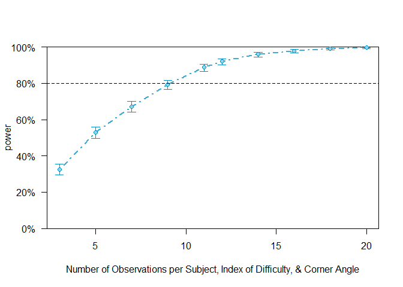

## Sources 
1. Green & MacLeod's 2016 paper, titled, "SIMR: an R package for power analysis of generalized linear mixed models by simulation"
2. Dr. Humburg's post on conducting power analyses using "simr" (https://humburg.github.io/Power-Analysis/simr_power_analysis.html)

## Data Generation
### Create the Dataframe
#### In this section, we create the base dataframe with corner angles and indexes of difficulty for our population.

```r
# first, create our variables
angle <- c(45, 90, 135) # three different corner angles
index <- c(1.17, 0.874, 0.7, 0.585, 0.503) # three indexes of difficulty
ss <- 999990 # create a sample size for our population
angle2 <- rep(angle, each = ss/3) # repeat instruction methods 
index2 <- rep(rep(index, each = ss/15), 3) # repeat index of difficulty

# concatenate into a dataframe
df_pop <- data.frame(corner_angle=factor(angle2), indx_dff=index2)
```

### Estimate Cornering Times
#### In this section, we create the estimated cornering times. We will do this using Pastel et al.'s (2007) fitted model (plus some variability). These will serve as the cornering times for the 90-degree corners, as this model was developed using 90-degree corners.
#### We will then do the same for the different corner angles. We will increase and decrease cornering times by 20% for the 135-degree and 45-degree corner angles, respectively. We do this because it is expected that cornering time will be affected by corner angle. 


```r
# define error term to induce some variability in our estimates 
error_term <- rnorm(ss/15, mean=0, sd = 0.7) 

# use Pastel et al.'s (2007) fitted model to get estimated cornering times for each index of difficulty & corner angle

# 45 degrees
Y1 <- (0.975 + .787*1.17 + error_term)*1.2
Y2 <- (0.975 + .787*0.874 + error_term)*1.2
Y3 <- (0.975 + .787*0.7 + error_term)*1.2
Y4 <- (0.975 + .787*0.585 + error_term)*1.2
Y5 <- (0.975 + .787*0.503 + error_term)*1.2

# 90 degrees
Y6 <- (0.975 + .787*1.17 + error_term)
Y7 <- (0.975 + .787*0.874 + error_term)
Y8 <- (0.975 + .787*0.7 + error_term)
Y9 <- (0.975 + .787*0.585 + error_term)
Y10 <- (0.975 + .787*0.503 + error_term)

# 135 degrees
Y11 <- (0.975 + .787*1.17 + error_term)*.8
Y12 <- (0.975 + .787*0.874 + error_term)*.8
Y13 <- (0.975 + .787*0.7 + error_term)*.8
Y14 <- (0.975 + .787*0.585 + error_term)*.8
Y15 <- (0.975 + .787*0.503 + error_term)*.8

# finally, we append to the population dataframe
df_pop$ct <- c(Y1, Y2, Y3, Y4, Y5, Y6, Y7, Y8, Y9, Y10, Y11, Y12, Y13, Y14, Y15)

# then, we create a sample of this population
pid <- factor(1:5) # five subjects
PID <- rep(pid, each = 15) # repeat participant ID 15 times each
ANGLE <- rep(rep(angle, each = 5), 5) # repeat each angle 5 times and do that 5 times
ID <- rep(index, 15) # repeat index of difficulty values 15 times

# concatenate into a dataframe
df_sample <- data.frame(PID=PID, ANGLE=factor(ANGLE), ID=ID)

# get cornering times from our population
df_sample$ct <- matrix(replicate(5, c(sample(Y1, 1, replace = T), sample(Y2, 1, replace = T), 
                                      sample(Y3, 1, replace = T), sample(Y4, 1, replace = T), 
                                      sample(Y5, 1, replace = T), sample(Y6, 1, replace = T),
                                      sample(Y7, 1, replace = T), sample(Y8, 1, replace = T),
                                      sample(Y9, 1, replace = T), sample(Y10, 1, replace = T),
                                      sample(Y11, 1, replace = T), sample(Y12, 1, replace = T),
                                      sample(Y13, 1, replace = T), sample(Y14, 1, replace = T),
                                      sample(Y15, 1, replace = T))), ncol=1)

# view dataframe
head(df_sample, n = 12)
```

```
##    PID ANGLE    ID        ct
## 1    1    45 1.170 2.9747635
## 2    1    45 0.874 1.6482865
## 3    1    45 0.700 1.0894874
## 4    1    45 0.585 2.3578252
## 5    1    45 0.503 0.2505052
## 6    1    90 1.170 1.8689308
## 7    1    90 0.874 1.8361184
## 8    1    90 0.700 2.3704704
## 9    1    90 0.585 0.8065400
## 10   1    90 0.503 2.3261066
## 11   1   135 1.170 1.4539065
## 12   1   135 0.874 1.1719476
```


## Power Analysis
### Simluate Baseline Model
#### In this section, we use the simr package to estimate power

```r
# load simr package 
library(simr)
```

```
## Warning: package 'simr' was built under R version 4.0.3
```

```
## Loading required package: lme4
```

```
## Loading required package: Matrix
```

```
## Registered S3 methods overwritten by 'car':
##   method                          from
##   influence.merMod                lme4
##   cooks.distance.influence.merMod lme4
##   dfbeta.influence.merMod         lme4
##   dfbetas.influence.merMod        lme4
```

```
## 
## Attaching package: 'simr'
```

```
## The following object is masked from 'package:lme4':
## 
##     getData
```

```r
# set simr progress to FALSE
simrOptions(progress=FALSE)

# Now, to get what we believe the TRUE effects to be, we fit a linear model to the population data
fit <- lm(ct ~ corner_angle*indx_dff, data = df_pop)

# view model summary
summary(fit)
```

```
## 
## Call:
## lm(formula = ct ~ corner_angle * indx_dff, data = df_pop)
## 
## Residuals:
##     Min      1Q  Median      3Q     Max 
## -3.4199 -0.4607 -0.0024  0.4649  3.5659 
## 
## Coefficients:
##                           Estimate Std. Error t value Pr(>|t|)    
## (Intercept)               1.172248   0.004145  282.78   <2e-16 ***
## corner_angle90           -0.195375   0.005863  -33.33   <2e-16 ***
## corner_angle135          -0.390749   0.005863  -66.65   <2e-16 ***
## indx_dff                  0.944400   0.005167  182.77   <2e-16 ***
## corner_angle90:indx_dff  -0.157400   0.007308  -21.54   <2e-16 ***
## corner_angle135:indx_dff -0.314800   0.007308  -43.08   <2e-16 ***
## ---
## Signif. codes:  0 '***' 0.001 '**' 0.01 '*' 0.05 '.' 0.1 ' ' 1
## 
## Residual standard error: 0.7074 on 999984 degrees of freedom
## Multiple R-squared:  0.1698,	Adjusted R-squared:  0.1698 
## F-statistic: 4.089e+04 on 5 and 999984 DF,  p-value: < 2.2e-16
```

```r
# Now, we set our model parameters - extracted from the linear model we just fit 
fixed <- c(summary(fit)$coef[1], summary(fit)$coef[2], summary(fit)$coef[3],
           summary(fit)$coef[4], summary(fit)$coef[5], summary(fit)$coef[6])
rand <- 0.1 # assign random effect intercept variance
res <- 0.5 # assign residual variance

# fit the baseline simulation model using our sample dataframe
model <- makeLmer(y ~ ANGLE*ID + (1|PID), fixef = fixed, VarCorr = rand, sigma = res, data = df_sample)

# run simulation & compare to model without the interaction term
sim <- powerSim(model, nsim=100, test = fcompare(y~ANGLE+ID))
```

```
## boundary (singular) fit: see ?isSingular
```

```
## boundary (singular) fit: see ?isSingular
## boundary (singular) fit: see ?isSingular
## boundary (singular) fit: see ?isSingular
## boundary (singular) fit: see ?isSingular
## boundary (singular) fit: see ?isSingular
## boundary (singular) fit: see ?isSingular
## boundary (singular) fit: see ?isSingular
```

```r
# view power
sim
```

```
## Power for model comparison, (95% confidence interval):
##        6.00% ( 2.23, 12.60)
## 
## Test: Likelihood ratio
##       Comparison to y ~ ANGLE + ID + [re]
## 
## Based on 100 simulations, (1 warning, 0 errors)
## alpha = 0.05, nrow = 75
## 
## Time elapsed: 0 h 0 m 33 s
```


```r
# First, let's extend the number of participants to 20 instead of 5
model2 <- extend(model, along = 'PID', n=20)

# run the simulation
sim2 <- powerSim(model2, nsim = 500, test = fcompare(y~ANGLE+ID))

# View power
sim2
```

```
## Power for model comparison, (95% confidence interval):
##       13.60% (10.72, 16.92)
## 
## Test: Likelihood ratio
##       Comparison to y ~ ANGLE + ID + [re]
## 
## Based on 500 simulations, (0 warnings, 0 errors)
## alpha = 0.05, nrow = 300
## 
## Time elapsed: 0 h 1 m 29 s
```

```r
# Not quite. Let's also extend the number of trials for each index of difficulty for each subject 
model3 <- extend(model2, within = 'PID+ANGLE+ID', n=20)

# run the simulation 
sim3 <- powerSim(model3, nsim=500, test = fcompare(y~ANGLE+ID))

# view power
sim3
```

```
## Power for model comparison, (95% confidence interval):
##       99.00% (97.68, 99.67)
## 
## Test: Likelihood ratio
##       Comparison to y ~ ANGLE + ID + [re]
## 
## Based on 500 simulations, (1 warning, 0 errors)
## alpha = 0.05, nrow = 6000
## 
## Time elapsed: 0 h 4 m 39 s
```

```r
# fit power curve so we can visualize how power changes as the model is extended 
pc <- powerCurve(model3, test = fcompare(y~ANGLE+ID), within = 'PID+ANGLE+ID')

# plot the curve
plot(pc, xlab='Number of Observations per Subject, Index of Difficulty, & Corner Angle')
```

<!-- -->

```r
# print values
print(pc)
```

```
## Power for model comparison, (95% confidence interval),
## by number of observations within PID+ANGLE+ID:
##       3: 32.40% (29.50, 35.40) - 900 rows
##       5: 52.90% (49.75, 56.03) - 1500 rows
##       7: 67.20% (64.19, 70.11) - 2100 rows
##       9: 79.20% (76.55, 81.68) - 2700 rows
##      11: 88.80% (86.68, 90.69) - 3300 rows
##      12: 92.10% (90.25, 93.70) - 3600 rows
##      14: 96.00% (94.59, 97.13) - 4200 rows
##      16: 97.90% (96.81, 98.70) - 4800 rows
##      18: 99.10% (98.30, 99.59) - 5400 rows
##      20: 99.70% (99.13, 99.94) - 6000 rows
## 
## Time elapsed: 0 h 56 m 5 s
```

```r
# ok, we need ~9 observations within pid, instruction method, and index of difficulty; let's look specifically at this number of observations 
model4 <- extend(model2, within = 'PID+ANGLE+ID', n=9)

# power for interaction term
sim4 <- powerSim(model4, nsim=500, test = fcompare(y~ANGLE+ID))
sim4
```

```
## Power for model comparison, (95% confidence interval):
##       84.00% (80.49, 87.10)
## 
## Test: Likelihood ratio
##       Comparison to y ~ ANGLE + ID + [re]
## 
## Based on 500 simulations, (0 warnings, 0 errors)
## alpha = 0.05, nrow = 2700
## 
## Time elapsed: 0 h 5 m 10 s
```

```r
# power for main effect of index of difficulty
sim5 <- powerSim(model4, nsim=500, test = fcompare(y~ANGLE))
sim5
```

```
## Power for model comparison, (95% confidence interval):
##       100.0% (99.26, 100.0)
## 
## Test: Likelihood ratio
##       Comparison to y ~ ANGLE + [re]
## 
## Based on 500 simulations, (1 warning, 0 errors)
## alpha = 0.05, nrow = 2700
## 
## Time elapsed: 0 h 4 m 26 s
```

```r
# power for main effect of angle
sim6 <- powerSim(model4, nsim=500, test = fcompare(y~ID))
sim6
```

```
## Power for model comparison, (95% confidence interval):
##       100.0% (99.26, 100.0)
## 
## Test: Likelihood ratio
##       Comparison to y ~ ID + [re]
## 
## Based on 500 simulations, (0 warnings, 0 errors)
## alpha = 0.05, nrow = 2700
## 
## Time elapsed: 0 h 2 m 29 s
```
